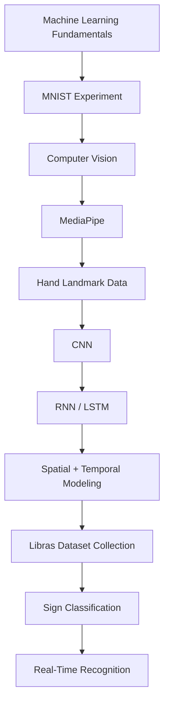
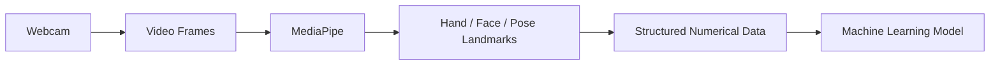

# Libras Sign Language Recognition

An experimental machine learning project for real-time Brazilian Sign Language (Libras) recognition using computer vision and temporal modeling.


## Table of Contents

- [Overview](#overview)
- [Motivation](#motivation)
- [Project Status](#project-status)
- [Learning Path](#learning-path)
- [Preliminary Experiment: MNIST](#preliminary-experiment-mnist)
- [Computer Vision and MediaPipe](#computer-vision-and-mediapipe-next-stage)
- [Spatial and Temporal Modeling](#spatial-and-temporal-modeling)
- [Roadmap](#roadmap)
- [Technologies](#technologies)
- [Repository Structure](#repository-structure)
- [Limitations](#limitations)
- [Author](#author)

## Overview

This project explores the development of a real-time Brazilian Sign Language (Libras) recognition system using computer vision and machine learning.

The long-term goal is to build a system capable of analyzing visual information from a webcam, extracting relevant features from the hands, face, and body, and recognizing signs in real time.

The project is being developed progressively, starting with fundamental machine learning experiments and moving toward computer vision, landmark extraction, temporal modeling, and eventually a real-time recognition system.

## Motivation

Communication is a fundamental part of human interaction, yet language barriers can make communication difficult between people who use different languages or communication systems.

This project also comes from something personal. My girlfriend's mother is blind, and getting to know her over time showed me, up close, how much harder everyday life can be when a disability is involved, and how specific the right kind of support has to be for each one. That is what first pushed me to point the things I enjoy building, software, computer vision, machine learning, toward accessibility instead of a generic project. Libras recognition is where I chose to start, since sign language is a daily communication barrier for a large part of the Deaf community in Brazil, and it lines up closely with the computer vision and real-time systems I most want to learn.

Beyond building a final application, the project is also an opportunity to study the complete process of developing a machine learning system: understanding the problem, collecting and processing data, selecting appropriate representations, training models, evaluating their performance, analyzing errors, and integrating the model into a real-time application.

## Project Status

> [!NOTE]
> **Early development.** The project is currently in the learning and experimentation stage. The first experiments focus on understanding the fundamental machine learning workflow before applying it to sign language recognition.

<details open>
<summary><strong>✅ Completed</strong></summary>

- [x] Learned the basic machine learning workflow
- [x] Loaded and explored the MNIST dataset
- [x] Created training, validation, and test sets
- [x] Built a simple neural network classifier
- [x] Compiled the model using Adam and sparse categorical cross-entropy
- [x] Trained the model
- [x] Evaluated the model on unseen test data
- [x] Generated predictions
- [x] Compared predictions with ground-truth labels
- [x] Performed basic error analysis
- [x] Visualized incorrect predictions

</details>

<details>
<summary><strong>🔧 In Progress</strong></summary>

- [ ] Learn MediaPipe
- [ ] Capture hand landmarks from a webcam
- [ ] Understand the 21 hand landmarks
- [ ] Explore landmark coordinates
- [ ] Experiment with MediaPipe Holistic
- [ ] Study CNN-based image classification
- [ ] Study RNN/LSTM-based sequence classification
- [ ] Explore combined spatial and temporal modeling

</details>

<details>
<summary><strong>📋 Planned</strong></summary>

- [ ] Build a landmark-based dataset
- [ ] Collect Brazilian Sign Language examples
- [ ] Design the first sign classification model
- [ ] Train and evaluate the model
- [ ] Analyze classification errors
- [ ] Build a real-time recognition pipeline
- [ ] Integrate the model into a usable application
- [ ] Document the final system and results

</details>

## Learning Path



The initial MNIST experiment is intentionally separate from the final Libras system. Its purpose is to understand the complete machine learning workflow before working with more complex real-world data.

## Preliminary Experiment: MNIST

Before working directly with Brazilian Sign Language data, a simple neural network was trained on the MNIST handwritten-digit dataset, to practice the complete machine learning pipeline (training, validation, testing, prediction, and error analysis) on a controlled, well-understood problem.

**Result: ≈97.74% test accuracy.**

Full details, architecture, and error analysis are documented in [`notebooks/01-mnist-classifier.md`](notebooks/01-mnist-classifier.md).

> [!IMPORTANT]
> MNIST is not part of the final Libras recognition system. It was a first experiment to learn the fundamental workflow before introducing the additional complexity of real-time video and human movement.

## Computer Vision and MediaPipe (next stage)

The next stage of the project focuses on extracting structured information from video:



MediaPipe provides 21 landmarks for each detected hand, each with spatial coordinates (x, y, z). This representation allows the project to work with structured information about hand position and movement rather than directly processing raw video frames.

## Spatial and Temporal Modeling

A major challenge of sign language recognition is that a sign is not always defined by a single static hand position, movement over time can contain important information. This motivates studying two types of models: CNNs for spatial patterns in a single frame, and RNNs/LSTMs for sequences where the order of observations over time matters. The project will investigate how these two forms of information can be combined for sign recognition.

## Roadmap

<details>
<summary><strong>Phase 1 — Machine Learning Fundamentals</strong></summary>

- Train a basic MNIST classifier
- Understand training, validation, and testing
- Understand model evaluation, generate predictions, analyze errors

</details>

<details>
<summary><strong>Phase 2 — Computer Vision</strong></summary>

- Install OpenCV and MediaPipe
- Capture webcam video, detect hands, visualize landmarks
- Explore MediaPipe Holistic

</details>

<details>
<summary><strong>Phase 3 — Machine Learning for Movement</strong></summary>

- Study CNNs, RNNs, LSTMs
- Understand spatial vs. temporal information
- Explore spatial + temporal architectures

</details>

<details>
<summary><strong>Phase 4 — Dataset</strong></summary>

- Define initial sign vocabulary
- Design data collection process, collect and label landmark sequences
- Split data into training, validation, and test sets

</details>

<details>
<summary><strong>Phase 5 — Sign Recognition Model</strong></summary>

- Build, train, and evaluate the first classifier
- Analyze errors, iterate on architecture and dataset

</details>

<details>
<summary><strong>Phase 6 — Real-Time System</strong></summary>

- Connect webcam input to the trained model
- Real-time landmark extraction and prediction
- Improve robustness and latency

</details>

<details>
<summary><strong>Phase 7 — Final Application</strong></summary>

- Build the final interface
- Document the system, evaluate real-world performance, record limitations

</details>

## Technologies

| Category | Tools |
|---|---|
| Language | Python |
| Machine Learning | TensorFlow / Keras |
| Data | NumPy, Matplotlib |
| Computer Vision | OpenCV *(planned)* |
| Landmark Extraction | MediaPipe *(planned)* |

## Repository Structure

```
libras-sign-language-recognition/
│
├── README.md
├── .gitignore
│
└── notebooks/
    └── 01-mnist-classifier.ipynb
```

The repository structure will evolve as new experiments and components are developed.

## Limitations

> [!WARNING]
> This project is currently an experimental and educational project. The current implementation does not yet provide Brazilian Sign Language translation or recognition. The project is still in development, and future stages will determine how accurately signs can be recognized under different conditions.

## Author

**Davi** — independent student researcher and developer.

This project is being developed as an independent passion project focused on machine learning, computer vision, and Brazilian Sign Language recognition.
