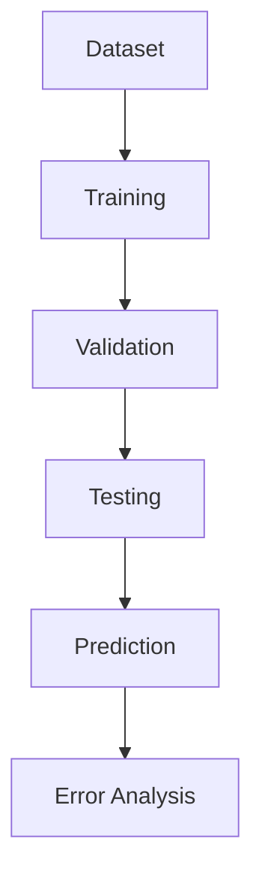
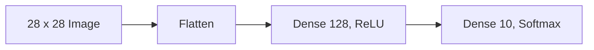

# Experiment 01 — MNIST Classifier

Before working directly with Brazilian Sign Language data, I trained a simple neural network on the **MNIST** handwritten-digit dataset.

The purpose of this experiment was to understand the complete machine learning pipeline:

---

## Dataset

MNIST contains grayscale images of handwritten digits from 0 to 9. Each image has a resolution of **28 x 28 pixels**.

The dataset was divided into:
* **Training:** 54,000 images
* **Validation:** 6,000 images
* **Testing:** 10,000 images

> *The test set was kept separate from training so that the final evaluation could measure performance on previously unseen data.*

---

## Model Architecture

The first classifier uses a simple feed-forward neural network:

* **Flatten:** Converts the 28 x 28 image into a one-dimensional vector containing **784 values** (28 × 28 = 784).
* **Dense(128):** The first trainable layer, containing 128 neurons. Each neuron learns parameters that help the network recognize patterns in the input.
* **Dense(10):** The final layer, with 10 outputs, corresponding to the ten possible digits (0 through 9). The *softmax* activation converts the outputs into probabilities.

---

## Training

The model was compiled using:
* **Optimizer:** Adam
* **Loss Function:** Sparse categorical cross-entropy
* **Metrics:** Accuracy

The model was trained for **5 epochs** using the training set and evaluated against the validation set after each epoch.

---

## Results

The model correctly classified most of the 10,000 previously unseen test images:

| Metric | Value |
| :--- | :--- |
| **Test Accuracy** | `97.74%` |
| **Test Loss** | `0.0729` |

---

## Error Analysis

* **Total Mistakes:** 226 incorrect predictions

Instead of only looking at the final accuracy, individual mistakes were also inspected. For example, one test image was classified as:
* **Predicted:** `8`
* **Actual:** `9`

Visualizing incorrect predictions helps identify cases where the model struggles, and provides a more useful understanding of model behavior than accuracy alone.

---

## Why MNIST?

MNIST is **not** part of the final Libras (Brazilian Sign Language) recognition system. It was used as a controlled first experiment to learn the fundamental workflow of supervised machine learning, before introducing the additional complexity of real-time video and human movement.
